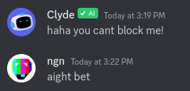

## 🤖 Clyde Block Script
Just a simple python script to block discord's "AI" bot, clyde

<br>
<br>

## 📑 Usage 
### Windows
- Download the latest release from the [releases tab](https://github.com/ngn13/clyde-blocker/releases)
- Double click on the EXE file to run it 
- You may see a smart screen dialog with the title "Windows Protected Your PC"
or something like that, windows is just complaining because the executable is not signed 
(it does not have a certificate), click on "Run anyway"

### Linux (and macos)
Just copy the `main.py` script and run it with python (version 3), make sure
you have `requests` module installed, if you don't have it installed, then install 
it with your package manager.

For example if you are on arch:
```bash
sudo pacman -S python-requests
```

<br>

## ⚙ Getting your discord token
The program will ask you to enter your discord token, if you don't know
how to get your token, [here's a random tutorial that i found on youtube](https://www.youtube.com/watch?v=b1SY4zTNnAE)


And if get any errors etc. [create an issue](https://github.com/ngn13/clyde-blocker/issues)

<br>
